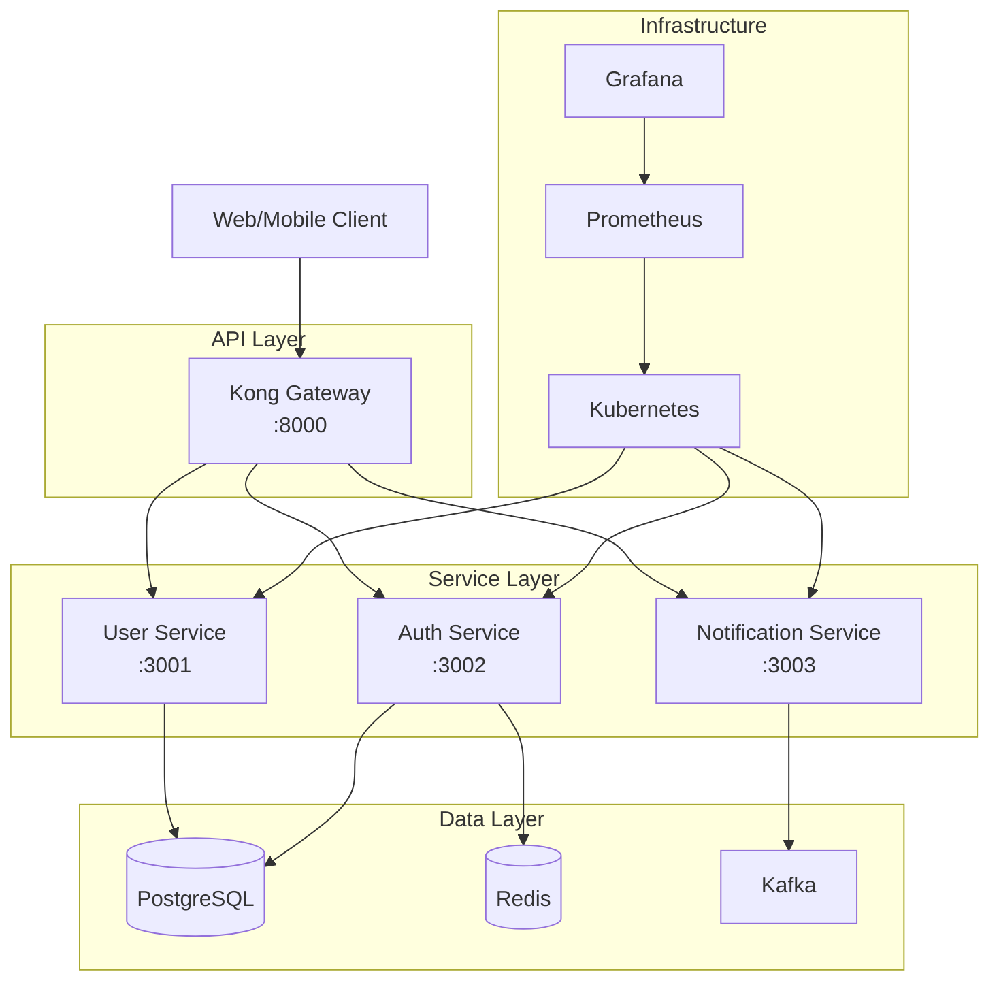

# 🚀 Node.js Microservices with Nx, Kubernetes & Terraform

[](https://github.com/yourusername/node-microservices/actions/workflows/ci-cd.yml)
[](https://opensource.org/licenses/MIT)
[](https://nx.dev)
[](https://kubernetes.io)
[](https://terraform.io)

A production-ready microservices architecture built with Node.js, managed with Nx monorepo, deployed on Kubernetes, and provisioned with Terraform. This project demonstrates best practices for building scalable, maintainable cloud-native applications.

## 📑 Table of Contents

- [Overview](#-overview)
- [Architecture](#-architecture)
- [Features](#-features)
- [Technology Stack](#-technology-stack)
- [Project Structure](#-project-structure)
- [Getting Started](#-getting-started)
- [Development](#-development)
- [Testing](#-testing)
- [Deployment](#-deployment)
- [Monitoring & Observability](#-monitoring--observability)
- [Security](#-security)
- [Contributing](#-contributing)
- [Documentation](#-documentation)
- [Support](#-support)
- [License](#-license)

## 🎯 Overview

This project implements a microservices architecture for a modern web application with the following services:

- **API Gateway**: Central entry point for all client requests
- **User Service**: User management and profiles
- **Auth Service**: Authentication and authorization
- **Notification Service**: Email and push notifications

### Key Benefits

- ✅ **Scalability**: Each service can be scaled independently
- ✅ **Maintainability**: Clean separation of concerns
- ✅ **Developer Experience**: Nx tooling for efficient development
- ✅ **Production Ready**: Complete CI/CD, monitoring, and infrastructure
- ✅ **Cloud Native**: Kubernetes-first approach
- ✅ **Infrastructure as Code**: Reproducible environments with Terraform

## 🏗 Architecture



### Design Principles

- **Domain-Driven Design**: Services organized around business capabilities
- **API-First**: All communication through well-defined APIs
- **Event-Driven**: Asynchronous communication via message queues
- **12-Factor App**: Following cloud-native best practices
- **Security by Design**: Authentication, authorization, and encryption built-in

## ✨ Features

### Core Features
- 🔐 **JWT-based Authentication**: Secure token-based auth with Kong
- 👥 **User Management**: Complete CRUD operations
- 📧 **Email Notifications**: Transactional email support
- 🔄 **Kong API Gateway**: Advanced routing, rate limiting, and plugins
- 📊 **Health Checks**: Kubernetes-compatible health endpoints
- 🎯 **Request Tracing**: Distributed tracing with correlation IDs
- 🛡️ **API Security**: Kong auth plugins (Key Auth, JWT, OAuth2)
- ⚡ **Performance**: Kong caching and load balancing
- 📈 **API Analytics**: Built-in Prometheus metrics

### DevOps Features
- 🚀 **CI/CD Pipeline**: Automated testing and deployment
- 📦 **Container Ready**: Optimized Docker images
- ☸️ **Kubernetes Native**: Helm charts and Kustomize configs
- 🏗 **Infrastructure as Code**: Complete Terraform modules
- 📈 **Monitoring**: Prometheus metrics and Grafana dashboards
- 📝 **Structured Logging**: JSON logs with correlation

### Development Features
- 🏢 **Nx Monorepo**: Efficient builds and testing
- 🧪 **Comprehensive Testing**: Unit, integration, and E2E tests
- 📚 **API Documentation**: OpenAPI/Swagger specs
- 🔄 **Hot Reload**: Fast development cycle
- 🎨 **Code Quality**: ESLint, Prettier, and Husky hooks
- 🐛 **Debugging**: VS Code launch configurations

## 🛠 Technology Stack

### Backend
- **Runtime**: Node.js 20 LTS
- **Framework**: Express.js with TypeScript
- **API Gateway**: Kong Gateway 3.4
- **Authentication**: Passport.js with JWT + Kong Auth Plugins
- **Database**: PostgreSQL 15
- **Cache**: Redis 7
- **Message Queue**: Apache Kafka
- **ORM**: Prisma

### Infrastructure
- **Container**: Docker
- **Orchestration**: Kubernetes 1.28+
- **Service Mesh**: Istio (optional)
- **Infrastructure**: Terraform
- **Cloud**: AWS/GCP/Azure compatible
- **CI/CD**: GitHub Actions

### Monitoring & Observability
- **Metrics**: Prometheus
- **Visualization**: Grafana
- **Logging**: ELK Stack (Elasticsearch, Logstash, Kibana)
- **Tracing**: Jaeger
- **Alerting**: AlertManager

### Development Tools
- **Monorepo**: Nx
- **Package Manager**: pnpm
- **Testing**: Jest, Supertest
- **API Testing**: Postman/Insomnia
- **Code Quality**: ESLint, Prettier
- **Git Hooks**: Husky, lint-staged

## 📁 Project Structure

```
node-microservices/
├── apps/                       # Application code
│   ├── api-gateway/           # API Gateway service
│   ├── user-service/          # User management service
│   ├── auth-service/          # Authentication service
│   └── notification-service/  # Notification service
├── libs/                      # Shared libraries
│   ├── common/               # Common utilities
│   ├── types/                # TypeScript types
│   └── config/               # Configuration management
├── tools/                     # Development tools
│   ├── scripts/              # Build and deployment scripts
│   └── generators/           # Nx generators
├── k8s/                      # Kubernetes manifests
│   ├── base/                 # Base configurations
│   └── overlays/             # Environment-specific configs
├── helm/                     # Helm charts
│   └── microservices/        # Main application chart
├── terraform/                # Infrastructure as Code
│   ├── modules/              # Reusable modules
│   └── environments/         # Environment configs
├── docker/                   # Docker configurations
├── docs/                     # Documentation
├── .github/                  # GitHub Actions workflows
└── configs/                  # Configuration files
```

## 🚀 Getting Started

### Prerequisites

- **Node.js**: v20.x or higher
- **pnpm**: v8.x or higher
- **Docker**: v24.x or higher
- **Kubernetes**: v1.28.x or higher (minikube for local)
- **Terraform**: v1.5.x or higher
- **kubectl**: Latest version
- **Helm**: v3.x or higher

### Quick Start

1. **Clone the repository**
   ```bash
   git clone https://github.com/yourusername/node-microservices.git
   cd node-microservices
   ```

2. **Install dependencies**
   ```bash
   pnpm install
   ```

3. **Set up environment**
   ```bash
   cp .env.example .env
   # Edit .env with your configuration
   ```

4. **Start infrastructure**
   ```bash
   docker-compose up -d postgres redis kafka
   ```

5. **Run database migrations**
   ```bash
   pnpm prisma:migrate
   ```

6. **Start services in development**
   ```bash
   pnpm nx run-many --target=serve --all
   ```

7. **Access services**
   - Kong Gateway: http://localhost:8000
   - Kong Admin API: http://localhost:8001
   - Kong Manager: http://localhost:8002
   - User Service (via Kong): http://localhost:8000/api/users
   - Auth Service (via Kong): http://localhost:8000/api/auth
   - Notification Service (via Kong): http://localhost:8000/api/notifications

### First Request

```bash
# Register a new user (via Kong Gateway)
curl -X POST http://localhost:8000/api/auth/register \
  -H "Content-Type: application/json" \
  -d '{
    "email": "user@example.com",
    "password": "SecurePass123!",
    "name": "John Doe"
  }'

# With API Key authentication
curl -X POST http://localhost:8000/api/auth/register \
  -H "Content-Type: application/json" \
  -H "apikey: admin-api-key-12345" \
  -d '{
    "email": "user@example.com",
    "password": "SecurePass123!",
    "name": "John Doe"
  }'
```

## 💻 Development

### Available Commands

```bash
# Development
pnpm nx serve api-gateway        # Start a specific service
pnpm nx run-many --target=serve  # Start all services
pnpm nx test user-service        # Run tests for a service
pnpm nx lint auth-service        # Lint a service

# Building
pnpm nx build api-gateway        # Build a specific service
pnpm nx run-many --target=build  # Build all services

# Database
pnpm prisma:generate             # Generate Prisma client
pnpm prisma:migrate              # Run migrations
pnpm prisma:studio               # Open Prisma Studio

# Docker
pnpm docker:build                # Build all images
pnpm docker:push                 # Push images to registry

# Kong Gateway
make kong-setup                  # Initialize Kong configuration
make kong-status                 # Check Kong status
make kong-services               # List Kong services
make kong-routes                 # List Kong routes

# Kubernetes
pnpm k8s:deploy                  # Deploy to Kubernetes
pnpm k8s:logs api-gateway        # View logs
```

### Adding a New Service

1. **Generate service scaffold**
   ```bash
   pnpm nx g @nx/node:app my-new-service
   ```

2. **Add service configuration**
   ```typescript
   // apps/my-new-service/src/main.ts
   import express from 'express';
   import { setupMiddleware } from '@microservices/common';
   
   const app = express();
   setupMiddleware(app);
   
   // Add your routes here
   
   const port = process.env.PORT || 3004;
   app.listen(port, () => {
     console.log(`Service listening on port ${port}`);
   });
   ```

3. **Update infrastructure**
   - Add Kubernetes manifests
   - Update Helm values
   - Add to docker-compose.yml

### Code Style Guide

- Use TypeScript for all code
- Follow ESLint configuration
- Write tests for all features
- Document all APIs with OpenAPI
- Use conventional commits

## 🧪 Testing

### Testing Strategy

```
┌─────────────┐
│   E2E Tests │ (10%)
├─────────────┤
│ Integration │ (30%)
│   Tests     │
├─────────────┤
│    Unit     │ (60%)
│   Tests     │
└─────────────┘
```

### Running Tests

```bash
# Unit tests
pnpm nx test user-service

# Integration tests
pnpm nx test-integration user-service

# E2E tests
pnpm nx e2e api-gateway-e2e

# All tests with coverage
pnpm test:all
```

### Writing Tests

```typescript
// Example unit test
describe('UserService', () => {
  it('should create a new user', async () => {
    const user = await userService.create({
      email: 'test@example.com',
      name: 'Test User'
    });
    
    expect(user).toHaveProperty('id');
    expect(user.email).toBe('test@example.com');
  });
});
```

## 📦 Deployment

### Local Kubernetes (Minikube)

```bash
# Start Minikube
minikube start --cpus=4 --memory=8192

# Build images
pnpm docker:build

# Deploy with Helm
helm install microservices ./helm/microservices \
  -f ./helm/microservices/values.development.yaml

# Access services
minikube service api-gateway
```

### Production Deployment

1. **Provision Infrastructure**
   ```bash
   cd terraform
   terraform init
   terraform plan -var-file=environments/production.tfvars
   terraform apply -var-file=environments/production.tfvars
   ```

2. **Deploy Application**
   ```bash
   # Configure kubectl
   aws eks update-kubeconfig --name production-cluster
   
   # Deploy with Helm
   helm upgrade --install microservices ./helm/microservices \
     -f ./helm/microservices/values.production.yaml \
     --namespace production
   ```

3. **Verify Deployment**
   ```bash
   kubectl get pods -n production
   kubectl get svc -n production
   ```

### CI/CD Pipeline

The GitHub Actions pipeline automatically:

1. Runs tests on pull requests
2. Build and pushes Docker images on merge to main
3. Deploys to staging environment
4. Runs smoke tests
5. Requires manual approval for production
6. Deploys to production

## 📊 Monitoring & Observability

### Metrics

Access Grafana dashboards:
```bash
kubectl port-forward -n monitoring svc/grafana 3000:80
```

Available dashboards:
- Service Health Overview
- API Gateway Metrics
- Database Performance
- Kubernetes Cluster Health

### Logs

View centralized logs:
```bash
# All services
kubectl logs -n default -l app=microservices --tail=100

# Specific service
kubectl logs -n default -l app=user-service --tail=100 -f
```

### Alerts

Configured alerts:
- High error rate (>1%)
- Response time (>500ms p95)
- Pod restarts
- Resource usage (>80%)
- Database connection issues

## 🔒 Security

### Security Features

- **Authentication**: JWT tokens with refresh mechanism
- **Authorization**: Role-based access control (RBAC)
- **Encryption**: TLS for all communications
- **Secrets Management**: Kubernetes secrets with encryption
- **Network Policies**: Service-to-service communication restrictions
- **Security Scanning**: Container image vulnerability scanning

### Security Best Practices

1. **Never commit secrets** - Use environment variables
2. **Keep dependencies updated** - Regular security audits
3. **Use least privilege** - Minimal permissions for services
4. **Enable audit logging** - Track all API access
5. **Regular backups** - Automated database backups

## 🤝 Contributing

We welcome contributions! Please see our [Contributing Guide](CONTRIBUTING.md) for details.

### Development Process

1. Fork the repository
2. Create a feature branch (`git checkout -b feature/amazing-feature`)
3. Commit your changes (`git commit -m 'feat: add amazing feature'`)
4. Push to the branch (`git push origin feature/amazing-feature`)
5. Open a Pull Request

### Commit Convention

We use [Conventional Commits](https://www.conventionalcommits.org/):

- `feat:` New feature
- `fix:` Bug fix
- `docs:` Documentation changes
- `style:` Code style changes
- `refactor:` Code refactoring
- `test:` Test changes
- `chore:` Build process or auxiliary tool changes

## 📚 Documentation

- [Full Documentation](./docs/README.md)
- [API Documentation](./docs/api/README.md)
- [Kong Gateway Guide](./docs/api/kong-gateway.md)
- [Architecture Decisions](./docs/architecture/decisions/README.md)
- [Deployment Guide](./docs/deployment/README.md)
- [Troubleshooting](./docs/operations/troubleshooting.md)

## 🆘 Support

### Getting Help

- 📧 **Email**: support@example.com
- 💬 **Slack**: [Join our Slack](https://slack.example.com)
- 📖 **Wiki**: [Internal Wiki](https://wiki.example.com)
- 🐛 **Issues**: [GitHub Issues](https://github.com/yourusername/node-microservices/issues)

### Common Issues

1. **Service won't start**: Check environment variables and database connection
2. **Build fails**: Clear Nx cache with `pnpm nx reset`
3. **Tests failing**: Ensure test database is running
4. **Kubernetes deployment fails**: Check resource limits and image pull secrets

## 📄 License

This project is licensed under the MIT License - see the [LICENSE](LICENSE) file for details.

---

<div align="center">
  Made with ❤️ by the Development Team
  <br>
  <a href="https://github.com/yourusername/node-microservices/stargazers">⭐ Star us on GitHub</a>
</div> 