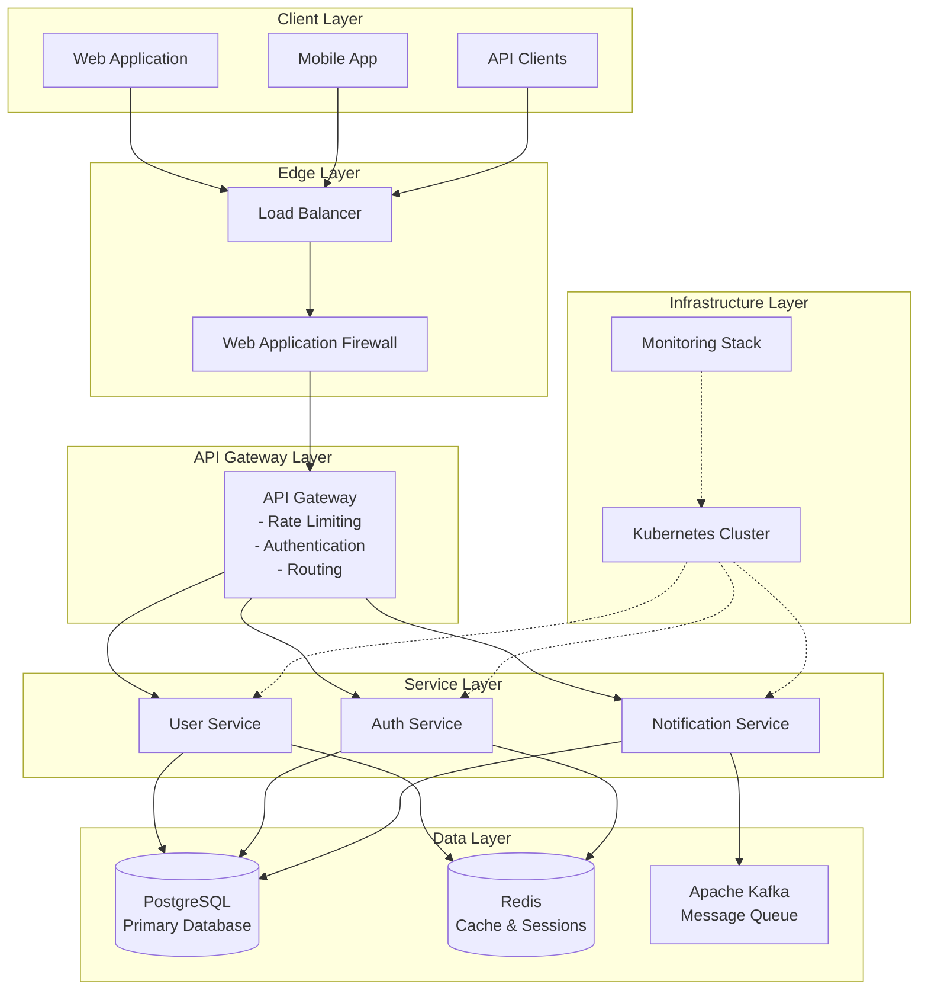
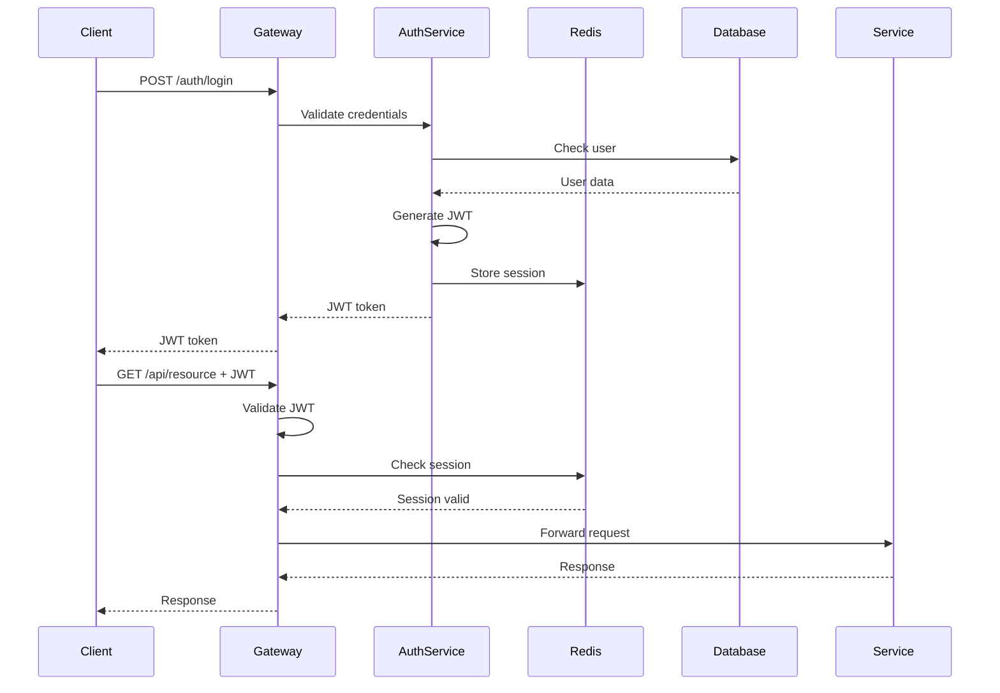
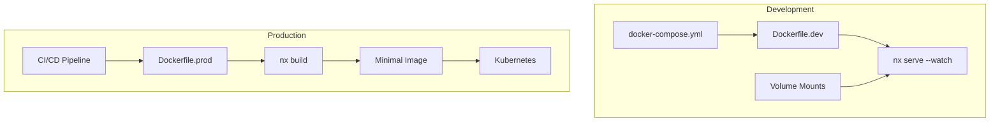

# System Architecture Overview

This document provides a comprehensive overview of the Node.js Microservices architecture, design decisions, and technical implementation details.

## 🏛 High-Level Architecture

### System Components



## 🎯 Architecture Principles

### 1. Microservices Pattern
Each service is:
- **Independently deployable**: Can be updated without affecting others
- **Loosely coupled**: Communicates via well-defined APIs
- **Single responsibility**: Focused on one business domain
- **Autonomous**: Owns its data and business logic

### 2. Domain-Driven Design (DDD)
Services are organized around business domains:
- **User Domain**: User profiles, preferences, management
- **Auth Domain**: Authentication, authorization, sessions
- **Notification Domain**: Email, SMS, push notifications

### 3. API-First Design
- All services expose RESTful APIs
- OpenAPI 3.0 specifications for all endpoints
- Consistent API conventions across services
- Versioned APIs for backward compatibility

### 4. Cloud-Native Architecture
- **Containerized**: All services run in Docker containers
- **Orchestrated**: Kubernetes manages deployment and scaling
- **Observable**: Built-in metrics, logs, and traces
- **Resilient**: Self-healing and fault-tolerant

## 🔧 Technical Stack Details

### API Gateway (Port 3000)

**Purpose**: Single entry point for all client requests

**Responsibilities**:
- Request routing to appropriate services
- Authentication and authorization
- Rate limiting and throttling
- Request/response transformation
- API versioning
- CORS handling
- Request logging and metrics

**Technology**: Express.js with custom middleware

**Key Features**:
```typescript
// Rate limiting configuration
{
  windowMs: 15 * 60 * 1000, // 15 minutes
  max: 100, // limit each IP to 100 requests per windowMs
  standardHeaders: true,
  legacyHeaders: false,
}

// Authentication flow
1. Client sends credentials
2. Gateway validates with Auth Service
3. JWT token issued
4. Token validated on subsequent requests
```

### User Service (Port 3001)

**Purpose**: Manage user profiles and data

**Database Schema**:
```prisma
model User {
  id        String   @id @default(uuid())
  email     String   @unique
  name      String
  profile   Profile?
  createdAt DateTime @default(now())
  updatedAt DateTime @updatedAt
}

model Profile {
  id         String   @id @default(uuid())
  bio        String?
  avatar     String?
  userId     String   @unique
  user       User     @relation(fields: [userId], references: [id])
  preferences Json?
}
```

**API Endpoints**:
- `GET /users` - List users (paginated)
- `GET /users/:id` - Get user details
- `POST /users` - Create user
- `PUT /users/:id` - Update user
- `DELETE /users/:id` - Delete user
- `GET /users/:id/profile` - Get user profile
- `PUT /users/:id/profile` - Update profile

### Auth Service (Port 3002)

**Purpose**: Handle authentication and authorization

**Security Features**:
- JWT token generation and validation
- Refresh token mechanism
- Password hashing with bcrypt
- Session management with Redis
- Multi-factor authentication support
- OAuth2 integration ready

**Token Structure**:
```json
{
  "sub": "user-uuid",
  "email": "user@example.com",
  "roles": ["user", "admin"],
  "iat": 1516239022,
  "exp": 1516239022
}
```

**Redis Session Storage**:
```
KEY: session:{sessionId}
VALUE: {
  userId: "uuid",
  createdAt: "timestamp",
  expiresAt: "timestamp",
  metadata: {}
}
TTL: 24 hours
```

### Notification Service (Port 3003)

**Purpose**: Handle all system notifications

**Supported Channels**:
- Email (SMTP, SendGrid, AWS SES)
- SMS (Twilio)
- Push notifications (FCM, APNS)
- In-app notifications

**Message Queue Integration**:
```typescript
// Kafka topic structure
Topics:
- notification.email.send
- notification.sms.send
- notification.push.send

// Message format
{
  id: "uuid",
  type: "email|sms|push",
  recipient: "user@example.com",
  template: "welcome",
  data: {
    name: "John Doe",
    // template variables
  },
  metadata: {
    userId: "uuid",
    priority: "high|normal|low"
  }
}
```

## 🗄 Data Architecture

### PostgreSQL Database

**Why PostgreSQL?**
- ACID compliance for data integrity
- JSON support for flexible schemas
- Full-text search capabilities
- Strong consistency guarantees
- Excellent performance at scale

**Database Per Service Pattern**:
```
userdb     - User Service database
authdb     - Auth Service database
notifydb   - Notification Service database
```

**Connection Pooling**:
```typescript
{
  min: 2,
  max: 10,
  idleTimeoutMillis: 30000,
  connectionTimeoutMillis: 2000,
}
```

### Redis Cache

**Use Cases**:
- Session storage
- API response caching
- Rate limiting counters
- Temporary data storage
- Pub/Sub for real-time features

**Cache Strategies**:
```typescript
// Cache-aside pattern
async getUser(id: string) {
  const cached = await redis.get(`user:${id}`);
  if (cached) return JSON.parse(cached);
  
  const user = await db.user.findUnique({ where: { id } });
  await redis.setex(`user:${id}`, 3600, JSON.stringify(user));
  return user;
}
```

### Apache Kafka

**Message Patterns**:
- **Events**: User actions, system events
- **Commands**: Async operations
- **Notifications**: Email/SMS queues

**Topic Design**:
```
user.created
user.updated
user.deleted
auth.login
auth.logout
notification.send
```

## 🔒 Security Architecture

### Defense in Depth

1. **Network Level**
   - WAF for application protection
   - DDoS protection
   - SSL/TLS encryption

2. **Application Level**
   - JWT authentication
   - Role-based access control
   - Input validation
   - SQL injection prevention

3. **Infrastructure Level**
   - Network policies in Kubernetes
   - Secret management
   - Container security scanning
   - Regular security updates

### Authentication Flow



## 📊 Monitoring & Observability

### Metrics Collection

**Prometheus Metrics**:
```typescript
// Service metrics
http_requests_total
http_request_duration_seconds
http_request_size_bytes
http_response_size_bytes

// Business metrics
users_registered_total
auth_attempts_total
notifications_sent_total

// System metrics
nodejs_heap_size_total_bytes
nodejs_external_memory_bytes
process_cpu_seconds_total
```

### Distributed Tracing

**Trace Context**:
```typescript
{
  traceId: "1234567890abcdef",
  spanId: "abcdef1234567890",
  parentSpanId: "fedcba0987654321",
  flags: "01"
}
```

### Logging Strategy

**Structured Logging Format**:
```json
{
  "timestamp": "2024-01-15T10:30:00.000Z",
  "level": "info",
  "service": "user-service",
  "traceId": "1234567890abcdef",
  "userId": "user-123",
  "message": "User profile updated",
  "metadata": {
    "duration": 45,
    "changes": ["email", "name"]
  }
}
```

## 🚀 Scalability Considerations

### Horizontal Scaling

**Service Replicas**:
```yaml
# Production configuration
apiGateway:
  replicas: 3
  resources:
    requests:
      cpu: 500m
      memory: 512Mi
    limits:
      cpu: 1000m
      memory: 1Gi

userService:
  replicas: 2
  autoscaling:
    enabled: true
    minReplicas: 2
    maxReplicas: 10
    targetCPU: 70
```

### Performance Optimization

1. **Caching Strategy**
   - Redis for hot data
   - CDN for static assets
   - Database query caching

2. **Database Optimization**
   - Connection pooling
   - Query optimization
   - Proper indexing
   - Read replicas for scaling

3. **Async Processing**
   - Message queues for heavy operations
   - Background jobs for non-critical tasks
   - Event-driven architecture

## 🔄 Deployment Architecture

### CI/CD Pipeline

```mermaid
graph LR
    Dev[Developer] --> Git[Git Push]
    Git --> GH[GitHub Actions]
    
    GH --> Test[Run Tests]
    Test --> Build[Build Images]
    Build --> Scan[Security Scan]
    Scan --> Push[Push to Registry]
    
    Push --> Stage[Deploy to Staging]
    Stage --> E2E[E2E Tests]
    E2E --> Approve[Manual Approval]
    Approve --> Prod[Deploy to Production]
```



### Environment Strategy

**Development**:
- Local Kubernetes (Minikube)
- Local databases
- Mock external services

**Staging**:
- Kubernetes cluster
- Separate databases
- Integration with test services

**Production**:
- Multi-AZ Kubernetes cluster
- Managed databases (RDS)
- Full monitoring stack
- Auto-scaling enabled

## 🐳 Docker Architecture

### Environment-Specific Dockerfiles

The project uses separate Dockerfiles optimized for each environment:

| Environment | Dockerfile | Purpose |
|-------------|------------|---------|
| Development | `Dockerfile.dev` | Hot reload with `nx serve --watch` |
| Production | `Dockerfile.prod` | Hardened, minimal image for Kubernetes |

### Development Container Strategy

Development Dockerfiles are designed for rapid iteration:

- **Single-stage image** with all dependencies (including devDependencies)
- **Source code mounted as volumes** for instant changes
- **Nx watch mode** for automatic recompilation
- **No build step** in the container (code compiled on-the-fly)

```dockerfile
# Example: Dockerfile.dev
FROM node:20-alpine
WORKDIR /app
COPY package*.json nx.json tsconfig.base.json ./
RUN npm ci --legacy-peer-deps
CMD ["npx", "nx", "serve", "auth-service"]
```

### Production Container Security

Production Dockerfiles follow security best practices:

| Practice | Implementation |
|----------|----------------|
| Multi-stage build | Separate build and runtime stages |
| Non-root user | `USER nodejs` (UID 1001) |
| Signal handling | `dumb-init` as PID 1 |
| Environment | `NODE_ENV=production` |
| Minimal deps | Nx `generatePackageJson` for production-only |
| No secrets | Runtime `env_file` / Kubernetes secrets |
| Health checks | Built-in container health monitoring |

### Docker Compose for Development

The `docker-compose.yml` is configured for development with:

- Volume mounts for hot reload
- Development Dockerfiles
- Infrastructure services (PostgreSQL, Keycloak)

```bash
# Start development environment
make docker-up

# Build production images for Kubernetes
make docker-build-prod
```

### Container Build Flow



## 📈 Future Considerations

### Planned Enhancements

1. **Service Mesh (Istio)**
   - Advanced traffic management
   - Service-to-service authentication
   - Circuit breaking
   - Canary deployments

2. **GraphQL Gateway**
   - Unified query interface
   - Schema stitching
   - Real-time subscriptions

3. **Event Sourcing**
   - Complete audit trail
   - Time-travel debugging
   - Event replay capability

4. **Multi-Region Deployment**
   - Global load balancing
   - Data replication
   - Disaster recovery

## 📚 References

- [Microservices Patterns](https://microservices.io/patterns/)
- [12-Factor App](https://12factor.net/)
- [Kubernetes Best Practices](https://kubernetes.io/docs/concepts/configuration/overview/)
- [OWASP Security Guidelines](https://owasp.org/) 